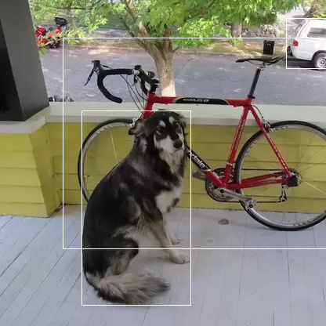

# ObjectDetector.jl

Object detection via YOLO in Julia. YOLO models are loaded directly from Darknet .cfg and .weights files as Flux models.


| **Platform**                                                               | **Build Status**                                                                                |
|:-------------------------------------------------------------------------------:|:-----------------------------------------------------------------------------------------------:|
| x86 & AARCH Linux, MacOS | [![][travis-img]][travis-url] |


## Installation

Requires julia v1.3+. From the Julia REPL, type `]` to enter the Pkg REPL mode and run:

```
pkg> add ObjectDetector
```

## Usage


### Loading and running on an image
```julia
using ObjectDetector, FileIO

yolomod = YOLO.v3_tiny_416_COCO(batch=1, silent=true) # Load the YOLOv3-tiny model pretrained on COCO, with a batch size of 1

batch = emptybatch(yolomod) # Create a batch object. Automatically uses the GPU if available

img = load(joinpath(dirname(dirname(pathof(ObjectDetector))),"test","images","dog-cycle-car.png"))

batch[:,:,:,1] .= gpu(resizePadImage(img, yolomod)) # Send resized image to the batch

res = yolomod(batch) # Run the model on the length-1 batch
```

### Visualzing the result
```julia
imgBoxes = drawBoxes(img, res)
save(joinpath(@__DIR__,"result.png"), imgBoxes)
```



## Pretrained Models
Most of the darknet models that are pretrained on the COCO dataset are available:
```julia
YOLO.v2_tiny_416_COCO()
YOLO.v3_320_COCO()
YOLO.v3_416_COCO()
YOLO.v3_608_COCO()
YOLO.v3_tiny_416_COCO()
```
The following are available but do not load due to bugs (work in progress)
```julia
YOLO.v2_608_COCO()
YOLO.v3_608_spp_COCO()
```

Or custom models can be loaded with:
```julia
YOLO.yolo("path/to/model.cfg", "path/to/weights.weights", 1)
```
where `1` is the batch size.

For instance the pretrained models are defined as:
```julia
v2_608_COCO(;batch=1, silent=false) = yolo(joinpath(models_dir,"yolov2-608.cfg"), getArtifact("yolov2-COCO"), batch, silent=silent)
```

The weights are stored as lazily-loaded julia artifacts.

## Benchmarking

Pretrained models can be easily tested with `ObjectDetector.benchmark()`.

Note that the benchmark was run once before the examples here. Initial load time
of the first model loaded is typically between 3-20 seconds.

A desktop with a GTX 2060:
```
julia> ObjectDetector.benchmark()

┌──────────────────┬─────────┬───────────────┬──────┬──────────────┬────────────────┐
│            Model │ loaded? │ load time (s) │ ran? │ run time (s) │ run time (fps) │
├──────────────────┼─────────┼───────────────┼──────┼──────────────┼────────────────┤
│ v2_tiny_416_COCO │    true │          0.16 │ true │       0.0037 │          266.7 │
│ v3_tiny_416_COCO │    true │         0.243 │ true │       0.0042 │          236.4 │
│      v3_320_COCO │    true │         1.264 │ true │       0.0209 │           47.8 │
│      v3_416_COCO │    true │         1.456 │ true │        0.031 │           32.3 │
│      v3_608_COCO │    true │         2.423 │ true │       0.0686 │           14.6 │
└──────────────────┴─────────┴───────────────┴──────┴──────────────┴────────────────┘
```

A 2019 Macbook Pro (CPU-only, no CUDA)
```
┌──────────────────┬─────────┬───────────────┬──────┬──────────────┬────────────────┐
│            Model │ loaded? │ load time (s) │ ran? │ run time (s) │ run time (fps) │
├──────────────────┼─────────┼───────────────┼──────┼──────────────┼────────────────┤
│ v2_tiny_416_COCO │    true │         0.305 │ true │       0.1383 │            7.2 │
│ v3_tiny_416_COCO │    true │         0.267 │ true │       0.1711 │            5.8 │
│      v3_320_COCO │    true │         1.617 │ true │       0.8335 │            1.2 │
│      v3_416_COCO │    true │         2.377 │ true │       1.4138 │            0.7 │
│      v3_608_COCO │    true │         4.239 │ true │       3.1122 │            0.3 │
└──────────────────┴─────────┴───────────────┴──────┴──────────────┴────────────────┘
```


[discourse-tag-url]: https://discourse.julialang.org/tags/yolo

[travis-img]: https://travis-ci.com/r3tex/ObjectDetector.jl.svg?branch=master
[travis-url]: https://travis-ci.com/r3tex/ObjectDetector.jl

[codecov-img]: https://codecov.io/gh/r3tex/ObjectDetector.jl/branch/master/graph/badge.svg
[codecov-url]: https://codecov.io/gh/r3tex/ObjectDetector.jl

[coveralls-img]: https://coveralls.io/repos/github/r3tex/ObjectDetector.jl/badge.svg?branch=master
[coveralls-url]: https://coveralls.io/github/r3tex/ObjectDetector.jl?branch=master

[issues-url]: https://github.com/r3tex/ObjectDetector.jl/issues
