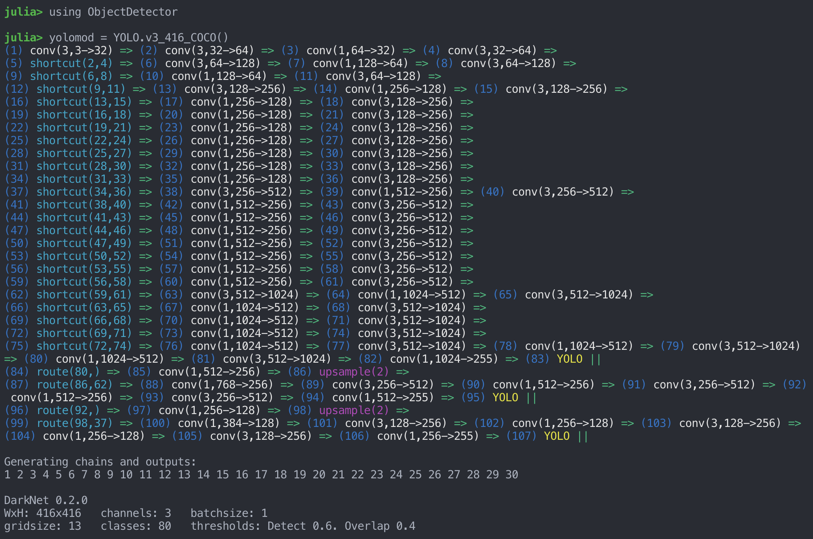
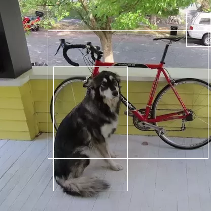
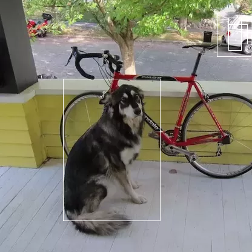
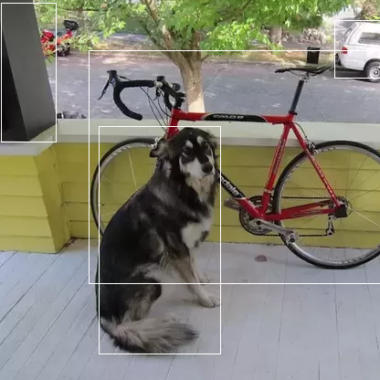

# ObjectDetector.jl

Object detection via YOLO in Julia. YOLO models are loaded directly from Darknet .cfg and .weights files as Flux models.
Uses CUDA, if available.

## Installation

Requires julia v1.3+. From the Julia REPL, type `]` to enter the Pkg REPL mode and run:

```
pkg> add ObjectDetector
```

## Usage



### Loading and running on an image
```julia
using ObjectDetector, FileIO

yolomod = YOLO.v3_608_COCO(batch=1, silent=true) # Load the YOLOv3-tiny model pretrained on COCO, with a batch size of 1

batch = emptybatch(yolomod) # Create a batch object. Automatically uses the GPU if available

img = load(joinpath(dirname(dirname(pathof(ObjectDetector))),"test","images","dog-cycle-car.png"))

batch[:,:,:,1], padding = prepareImage(img, yolomod) # Send resized image to the batch

res = yolomod(batch, detectThresh=0.5, overlapThresh=0.8) # Run the model on the length-1 batch
```

Note that while the convention in Julia is column-major, where images are loaded
such that a _widescreen_ image matrix would have a smaller 1st dimension than 2nd.
Darknet is row-major, so the image matrix needs to have its first and second dims
permuted before being passed to batch. Otherwise features may not be detected due to
being rotated 90º. The function `prepareImage()` includes this conversion automatically.

Also, non-square models can be loaded, but care should be taken to ensure that each
dimension is an integer multiple of the filter size of the first conv layer (typically 16 or 32).


### Visualizing the result
```julia
imgBoxes = drawBoxes(img, yolomod, padding, res)
save("result.png", imgBoxes)
```



## Pretrained Models
The darknet YOLO models from https://pjreddie.com/darknet/yolo/ that are pretrained on the COCO dataset are available:

```julia
YOLO.v2_COCO() #Currently broken
YOLO.v2_tiny_COCO()

YOLO.v3_COCO()
YOLO.v3_spp_608_COCO() #Currently broken
YOLO.v3_tiny_COCO()
```
Their width and height can be modified with:
```julia
YOLO.v3_COCO(w=416,h=416)
```
and further configurations can be modified by editing the .cfg file structure after its read, but before its loaded:
```julia
yolomod = YOLO.v3_COCO(silent=false, cfgchanges=[(:net, 1, :width, 512), (:net, 1, :height, 384)])
```
`cfgchanges` takes the form of a vector of tuples with:
`(layer symbol, ith layer that matches given symbol, field symbol, value)`
Note that if `cfgchanges` is provided, optional `h` and `w` args are ignored.

Also, convenient sized models can be loaded via:
```julia
YOLO.v2_608_COCO()
YOLO.v2_tiny_416_COCO()

YOLO.v3_320_COCO()
YOLO.v3_416_COCO()
YOLO.v3_608_COCO()
YOLO.v3_spp_608_COCO()
YOLO.v3_tiny_416_COCO()
```

Or custom models can be loaded with:
```julia
YOLO.yolo("path/to/model.cfg", "path/to/weights.weights", 1) # `1` is the batch size.
```

For instance the pretrained models are defined as:
```julia
function v3_COCO(;batch=1, silent=false, cfgchanges=nothing, w=416, h=416)
    cfgchanges=[(:net, 1, :width, w), (:net, 1, :height, h)]
    yolo(joinpath(models_dir,"yolov3-416.cfg"), joinpath(artifact"yolov3-COCO", "yolov3-COCO.weights"), batch, silent=silent, cfgchanges=cfgchanges)
end
```

The weights are stored as lazily-loaded julia artifacts (introduced in Julia 1.3).

## Benchmarking

Pretrained models can be easily tested with `ObjectDetector.benchmark()`.

Note that the benchmark was run once before the examples here. Initial load time
of the first model loaded is typically between 3-20 seconds. See the [package-compilation](#package-compilation)  section below for compilation instructions to speed up loading.

A desktop with a GTX 2060:
```
julia> ObjectDetector.benchmark()

┌──────────────────┬─────────┬───────────────┬──────┬──────────────┬────────────────┐
│            Model │ loaded? │ load time (s) │ ran? │ run time (s) │ run time (fps) │
├──────────────────┼─────────┼───────────────┼──────┼──────────────┼────────────────┤
│ v2_tiny_416_COCO │    true │          0.16 │ true │       0.0037 │          266.7 │
│ v3_tiny_416_COCO │    true │         0.243 │ true │       0.0042 │          236.4 │
│      v3_320_COCO │    true │         1.264 │ true │       0.0209 │           47.8 │
│      v3_416_COCO │    true │         1.456 │ true │        0.031 │           32.3 │
│      v3_608_COCO │    true │         2.423 │ true │       0.0686 │           14.6 │
└──────────────────┴─────────┴───────────────┴──────┴──────────────┴────────────────┘
```

A 2019 Macbook Pro (CPU-only, no CUDA):
```
┌──────────────────┬─────────┬───────────────┬──────┬──────────────┬────────────────┐
│            Model │ loaded? │ load time (s) │ ran? │ run time (s) │ run time (fps) │
├──────────────────┼─────────┼───────────────┼──────┼──────────────┼────────────────┤
│ v2_tiny_416_COCO │    true │         0.305 │ true │       0.1383 │            7.2 │
│ v3_tiny_416_COCO │    true │         0.267 │ true │       0.1711 │            5.8 │
│      v3_320_COCO │    true │         1.617 │ true │       0.8335 │            1.2 │
│      v3_416_COCO │    true │         2.377 │ true │       1.4138 │            0.7 │
│      v3_608_COCO │    true │         4.239 │ true │       3.1122 │            0.3 │
└──────────────────┴─────────┴───────────────┴──────┴──────────────┴────────────────┘
```

## Examples

All run with `detectThresh = 0.5`, `overlapThresh = 0.5`

### YOLO.v2_tiny_416_COCO


### YOLO.v3_tiny_416_COCO


### YOLO.v3_320_COCO


### YOLO.v3_416_COCO


### YOLO.v3_608_COCO


## Package Compilation

If initial load times are critical, the package can be compiled and loaded as a
sysimage, such that initial load time reduces to ~4 seconds, and loading of the
first model also takes ~4 seconds (as opposed to current performance on 1.3.0 of
~20 seconds for package load, and ~20 seconds for first model load).

See [dev/compilation/compiler.jl](dev/compilation/compiler.jl) for instructions.

[discourse-tag-url]: https://discourse.julialang.org/tags/yolo

[codecov-img]: https://codecov.io/gh/r3tex/ObjectDetector.jl/branch/master/graph/badge.svg
[codecov-url]: https://codecov.io/gh/r3tex/ObjectDetector.jl

[coveralls-img]: https://coveralls.io/repos/github/r3tex/ObjectDetector.jl/badge.svg?branch=master
[coveralls-url]: https://coveralls.io/github/r3tex/ObjectDetector.jl?branch=master

[issues-url]: https://github.com/r3tex/ObjectDetector.jl/issues
