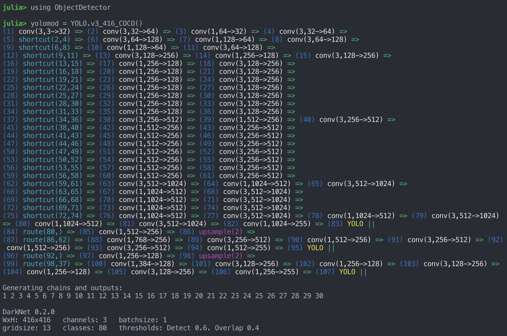
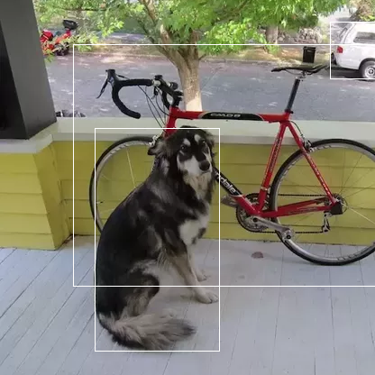
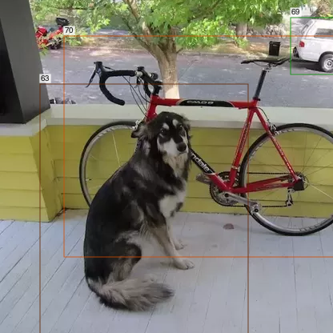
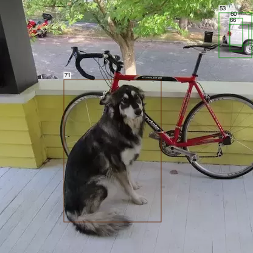
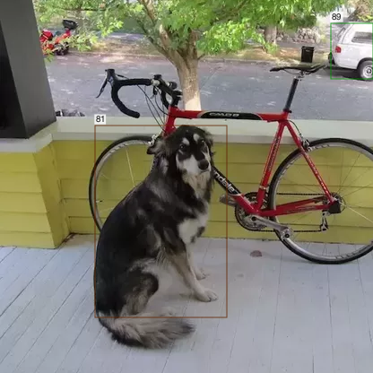
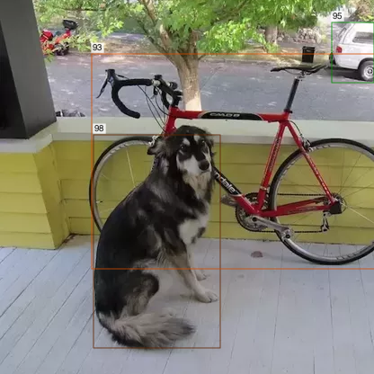
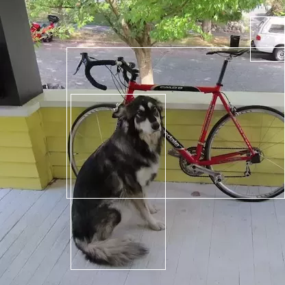

# ObjectDetector.jl

[](https://r3tex.github.io/ObjectDetector.jl/dev)

Object detection via YOLO in Julia. YOLO models are loaded directly from Darknet .cfg and .weights files as Flux models. Uses CUDA, if available.

Supported YOLO models are: `v2`, `v2-tiny`, `v3`, `v3-spp`, `v3-tiny`, `v4`, `v4-tiny`, `v4-csp`, `v4-csp-x-swish`, `v4x-mish`, `v4-p5`, `v4-p6` (Scaled-YOLOv4), `v7`, `v7-tiny`, `v7x`

Other less standard models may work also.

Note that all supported models have result parity with [AlexeyAB/darknet](https://github.com/AlexeyAB/darknet), and are directly tested against [Darknet.jl](https://github.com/IanButterworth/Darknet.jl) (see tests)

Training (fine-tuning and from-scratch) is supported for the v3, v4 and v7 model families — see [Training](#training) below.

## Installation

Requires julia v1.10+. From the Julia REPL, type `]` to enter the Pkg REPL mode and run:

```
pkg> add ObjectDetector
```

As of ObjectDetector v0.3, if you want to use CUDA acceleration you will also need to
add `CUDA` and `cuDNN` to your project and load both packages.

## Usage



### Loading and running on an image
```julia
using ObjectDetector, FileIO, ImageIO

yolomod = YOLO.v3_608_COCO(batch=1, silent=true) # Load the 608x608 YOLOv3 model pretrained on COCO, with a batch size of 1

batch = emptybatch(yolomod) # Create a batch object. Automatically uses the GPU if available

img = load(joinpath(dirname(dirname(pathof(ObjectDetector))),"test","images","dog-cycle-car.png"))

batch[:,:,:,1], padding = prepare_image(img, yolomod) # Send resized image to the batch

res = yolomod(batch, detect_thresh=0.5, overlap_thresh=0.8) # Run the model on the length-1 batch

# The result structure
i = 1 # take the first result
bbox = res[1:4, i]
objectness_score = res[5, i]
selected_class_confidence = res[end-2, i]
selected_class_id = res[end-1, i]
batch_id = res[end, i]
```

Note that while the convention in Julia is column-major, where images are loaded
such that a _widescreen_ image matrix would have a smaller 1st dimension than 2nd.
Darknet is row-major, so the image matrix needs to have its first and second dims
permuted before being passed to batch. Otherwise features may not be detected due to
being rotated 90º. The function `prepare_image()` includes this conversion automatically.

Also, non-square models can be loaded, but each dimension must be an integer
multiple of the network's maximum stride (32 for most models, 64 for `v4_p6`).


### CPU performance tips

The forward pass on CPU is dominated by BLAS matrix multiplies, so the BLAS
backend matters more than anything else:

- **Apple silicon**: load [AppleAccelerate.jl](https://github.com/JuliaLinearAlgebra/AppleAccelerate.jl)
  before running. Apple's AMX-backed sgemm is substantially faster than the
  default OpenBLAS (~35% faster end-to-end for `v3_416_COCO` on an M2 Pro):
  ```julia
  using AppleAccelerate, ObjectDetector
  ```
- **Intel CPUs**: [MKL.jl](https://github.com/JuliaLinearAlgebra/MKL.jl) typically
  plays the same role.
- BLAS threading (not Julia's `-t`) controls conv parallelism; the default
  thread count is usually right, but `LinearAlgebra.BLAS.set_num_threads`
  is the knob if you need to tune it.
- For throughput, prefer batching images (`YOLO.v3_416_COCO(batch=N)`) over
  repeated single-image calls: larger batches use the hardware more efficiently.

### CPU allocations management

On CPU an `AllocArrays` & `Adapt` - based allocator is used to reduce allocations.

To opt out of the allocator use `disallow_bumper=true`.
i.e.
```julia
yolomod = YOLO.v3_608_COCO(batch=1, disallow_bumper=true)
```

### Visualizing the result
```julia
imgBoxes = draw_boxes(img, yolomod, padding, res)
save("result.png", imgBoxes)
```



## Training

Training is supported for `[yolo]`-output models, both classic decode (`v3` family,
`v4`, `v4-tiny`) and `new_coords=1` scaled decode (`v4-csp` and the rest of the
scaled-YOLOv4 family, `v7` family). The yolov2 `[region]` models are not trainable.
The loss is a modern simplified YOLO loss (CIoU box loss + binary cross-entropy
objectness/class losses with best-anchor target assignment), not a reimplementation
of darknet's exact loss.

By default batchnorm is folded into the conv weights at load time, so training
behaves like fine-tuning with frozen batchnorm statistics — ideal for adapting
pretrained weights. For from-scratch training, construct the model with
`trainable_batchnorm=true` to keep live, trainable batchnorm layers (see below).

### Fine-tuning on a custom dataset

Datasets use darknet conventions: normalized `[class, cx, cy, w, h]` boxes, either
in-memory via `TrainSample`, or loaded from image + `.txt` label file pairs:

```julia
using ObjectDetector, FileIO, ImageIO

# yolov3-tiny with a fresh 2-class head, backbone initialized from pretrained
# COCO weights (block 15 is the yolov3-tiny.conv.15 backbone split)
cfg, weights = YOLO.YOLO_MODELS["v3_tiny_COCO"]()
yolomod = YOLO.Yolo(cfg, weights, 1;
    weights_stop_layer = 15,
    cfgchanges = [(:yolo, 1, :classes, 2), (:yolo, 2, :classes, 2),
                  (:convolutional, 10, :filters, 21), (:convolutional, 13, :filters, 21)])
                  # head conv filters = anchors_per_head * (5 + classes)

data = load_darknet_dataset("dataset/images", "dataset/labels") # paired .txt label files

result = train!(yolomod, data;
    epochs = 50, batchsize = 8, lr = 1e-3,
    image_loader = FileIO.load,
    checkpoint_dir = "checkpoints") # saves darknet-format .weights each epoch

result.losses # mean loss per epoch
```

The model is updated in place, so it can be used for inference as usual afterwards.
`save_weights(yolomod, "trained.weights")` writes darknet-format weights that reload
with the same cfg (and the same `cfgchanges`). Truncated darknet backbone files
(e.g. `yolov3-tiny.conv.15`) can also be loaded directly with
`allow_partial_weights=true`, which randomly initializes the remaining layers.

### Training from scratch

```julia
yolomod = YOLO.Yolo(cfg, nothing, 1;
    weights_stop_layer = 0,      # random-init all layers
    trainable_batchnorm = true,  # live batchnorm (needed for from-scratch convergence)
    cfgchanges = [...])          # classes/filters as above

train!(yolomod, data;
    epochs = 300, batchsize = 16, lr = 1e-3,
    warmup_batches = 1000,       # linear LR ramp (darknet burn-in)
    flip_augment = true,         # random horizontal mirroring
    image_loader = FileIO.load)
```

`save_weights` on a `trainable_batchnorm` model writes true darknet batchnorm
parameters; reloading without `trainable_batchnorm` folds them for fastest
inference, with equivalent outputs.

## Pretrained Models
The darknet YOLO models from https://pjreddie.com/darknet/yolo/ that are pretrained on the COCO dataset are available:

```julia
YOLO.v2_COCO()
YOLO.v2_tiny_COCO()

YOLO.v3_COCO()
YOLO.v3_spp_608_COCO()
YOLO.v3_tiny_COCO()

YOLO.v4_COCO()
YOLO.v4_tiny_COCO()

YOLO.v7_COCO()
YOLO.v7_tiny_COCO()

# Scaled-YOLOv4 family (native sizes: csp 512, csp_x_swish & x_mish 640, p5 896, p6 1280)
YOLO.v4_csp_COCO()
YOLO.v4_csp_x_swish_COCO()
YOLO.v4x_mish_COCO()
YOLO.v4_p5_COCO()
YOLO.v4_p6_COCO()

# larger yolov7 (native size 640)
YOLO.v7x_COCO()
```

Each model defaults to its native input size; pass `w`/`h` to override. Note
`v4_p6` requires dimensions divisible by 64 (the others require 32).
Their width and height can be modified with:
```julia
YOLO.v3_COCO(w=416,h=416)
```
and further configurations can be modified by editing the .cfg file structure after its read, but before its loaded:
```julia
yolomod = YOLO.v3_COCO(silent=false, cfgchanges=[(:net, 1, :width, 512), (:net, 1, :height, 384)])
```
`cfgchanges` takes the form of a vector of tuples with:
`(layer symbol, ith layer that matches given symbol, field symbol, value)`
Note that if `cfgchanges` is provided, optional `h` and `w` args are ignored.

Also, convenient sized models can be loaded via:
```julia
YOLO.v2_608_COCO()
YOLO.v2_tiny_416_COCO()

YOLO.v3_320_COCO()
YOLO.v3_416_COCO()
YOLO.v3_608_COCO()
YOLO.v3_spp_608_COCO()
YOLO.v3_tiny_416_COCO()
etc.
```

Or custom models can be loaded with:
```julia
YOLO.Yolo("path/to/model.cfg", "path/to/weights.weights", 1) # `1` is the batch size.
```

For instance the pretrained models are defined as:
```julia
function v3_COCO(;batch=1, silent=false, cfgchanges=nothing, w=416, h=416)
    cfgchanges=[(:net, 1, :width, w), (:net, 1, :height, h)]
    Yolo(joinpath(ObjectDetector.YOLO.models_dir(),"yolov3-416.cfg"), joinpath(artifact"yolov3-COCO", "yolov3-COCO.weights"), batch, silent=silent, cfgchanges=cfgchanges)
end
```

The weights are stored as lazily-loaded julia artifacts (introduced in Julia 1.3).

## Benchmarking

Pretrained models can be easily tested with `ObjectDetector.benchmark()`, after
loading its requirements: `using BenchmarkTools, PrettyTables`.

During the benchmark `detect_thresh` is minimized and `overlap_thresh` is maximised to return maximum
results, for worst case testing.

Note that the first model load will be slower due to JIT.

### A M2 Macbook Pro (CPU-only, no CUDA)

```
julia> ObjectDetector.benchmark()
┌──────────────────┬─────────┬───────────────┬──────────┬──────────────┬────────────────┬─────────────┐
│            Model │ loaded? │ load time (s) │ #results │ run time (s) │ run time (fps) │ allocations │
├──────────────────┼─────────┼───────────────┼──────────┼──────────────┼────────────────┼─────────────┤
│ v2_tiny_416_COCO │    true │         5.793 │      845 │       0.0385 │           26.0 │ 706.312 KiB │
│ v3_tiny_416_COCO │    true │         1.003 │     2535 │       0.0428 │           23.3 │   1.911 MiB │
│ v4_tiny_416_COCO │    true │         0.597 │     2535 │       0.0639 │           15.6 │   1.918 MiB │
│ v7_tiny_416_COCO │    true │         0.796 │    10647 │       0.2637 │            3.8 │   7.704 MiB │
│      v3_416_COCO │    true │         1.701 │    10647 │        0.354 │            2.8 │   7.773 MiB │
│  v3_spp_416_COCO │    true │         1.471 │    10647 │        0.399 │            2.5 │   7.870 MiB │
│      v4_416_COCO │    true │         1.681 │    10647 │       0.9003 │            1.1 │   7.994 MiB │
│      v7_416_COCO │    true │          1.45 │    10647 │       0.9375 │            1.1 │   7.833 MiB │
└──────────────────┴─────────┴───────────────┴──────────┴──────────────┴────────────────┴─────────────┘
```

### A desktop with an AMD Ryzen 9 5950X & RTX 3080

Without CUDA:
```
julia> ObjectDetector.benchmark()
┌──────────────────┬─────────┬───────────────┬──────────┬──────────────┬────────────────┬─────────────┐
│            Model │ loaded? │ load time (s) │ #results │ run time (s) │ run time (fps) │ allocations │
├──────────────────┼─────────┼───────────────┼──────────┼──────────────┼────────────────┼─────────────┤
│ v2_tiny_416_COCO │    true │        10.855 │      845 │        0.043 │           23.3 │ 686.102 KiB │
│ v3_tiny_416_COCO │    true │         1.604 │     2535 │       0.0491 │           20.4 │   1.882 MiB │
│ v4_tiny_416_COCO │    true │         0.923 │     2535 │       0.0796 │           12.6 │   1.900 MiB │
│ v7_tiny_416_COCO │    true │         1.269 │    10647 │        0.315 │            3.2 │   7.676 MiB │
│      v3_416_COCO │    true │         2.358 │    10647 │       0.3504 │            2.9 │   7.759 MiB │
│  v3_spp_416_COCO │    true │         1.607 │    10647 │       0.4139 │            2.4 │   7.713 MiB │
│      v4_416_COCO │    true │         2.097 │    10647 │        1.308 │            0.8 │   7.741 MiB │
│      v7_416_COCO │    true │         2.123 │    10647 │       1.0864 │            0.9 │   7.709 MiB │
└──────────────────┴─────────┴───────────────┴──────────┴──────────────┴────────────────┴─────────────┘
```
With CUDA
```
julia> using CUDA, cuDNN

julia> ObjectDetector.benchmark()
┌──────────────────┬─────────┬───────────────┬──────────┬──────────────┬────────────────┬─────────────┐
│            Model │ loaded? │ load time (s) │ #results │ run time (s) │ run time (fps) │ allocations │
├──────────────────┼─────────┼───────────────┼──────────┼──────────────┼────────────────┼─────────────┤
│ v2_tiny_416_COCO │    true │        20.528 │      844 │       0.0022 │          451.0 │   2.349 MiB │
│ v3_tiny_416_COCO │    true │         1.264 │     2534 │       0.0063 │          159.2 │  10.080 MiB │
│ v4_tiny_416_COCO │    true │          0.62 │     2534 │       0.0202 │           49.5 │  10.148 MiB │
│ v7_tiny_416_COCO │    true │          0.69 │    10646 │       0.3012 │            3.3 │ 115.685 MiB │
│      v3_416_COCO │    true │         1.204 │    10646 │       0.0587 │           17.0 │  97.878 MiB │
│  v3_spp_416_COCO │    true │         0.582 │    10646 │       0.1106 │            9.0 │ 189.964 MiB │
│      v4_416_COCO │    true │         0.944 │    10646 │       0.8072 │            1.2 │ 272.358 MiB │
│      v7_416_COCO │    true │         0.971 │    10646 │       0.5745 │            1.7 │ 199.325 MiB │
└──────────────────┴─────────┴───────────────┴──────────┴──────────────┴────────────────┴─────────────┘
```

## Examples

All run with `detect_thresh = 0.5`, `overlap_thresh = 0.5`

### YOLO.v2_tiny_416_COCO


### YOLO.v3_tiny_416_COCO


### YOLO.v3_416_COCO


### YOLO.v4_tiny_416_COCO


### YOLO.v4_416_COCO


### YOLO.v7_tiny_416_COCO


### YOLO.v7_416_COCO

