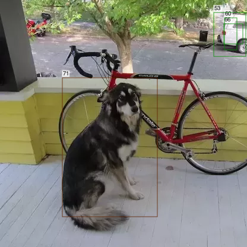

# ObjectDetector.jl

Object detection via YOLO in Julia. YOLO models are loaded directly from Darknet .cfg and .weights files as Flux models. Uses CUDA, if available.

Supported YOLO models are: `v2`, `v2-tiny`, `v3`, `v3-spp`, `v3-tiny`, `v4`, `v4-tiny`, `v7`, `v7-tiny`

Other less standard models may work also.

Note that v3+ models have result parity with [AlexeyAB/darknet](https://github.com/AlexeyAB/darknet), and are directly tested against [Darknet.jl](https://github.com/IanButterworth/Darknet.jl) (see tests)

Training using ObjectDetector is currently unproven/untested.

## Installation

Requires julia v1.10+. From the Julia REPL, type `]` to enter the Pkg REPL mode and run:

```
pkg> add ObjectDetector
```

As of ObjectDetector v0.3, if you want to use CUDA accelleration you will also need to
add `CUDA` and `cuDNN` to your project and load both packages.

## Usage


### Loading and running on an image
```julia
using ObjectDetector, FileIO, ImageIO

yolomod = YOLO.v3_608_COCO(batch=1, silent=true) # Load the YOLOv3-tiny model pretrained on COCO, with a batch size of 1

batch = emptybatch(yolomod) # Create a batch object. Automatically uses the GPU if available

img = load(joinpath(dirname(dirname(pathof(ObjectDetector))),"test","images","dog-cycle-car.png"))

batch[:,:,:,1], padding = prepare_image(img, yolomod) # Send resized image to the batch

res = yolomod(batch, detect_thresh=0.5, overlap_thresh=0.8) # Run the model on the length-1 batch

# The result structure
i = 1 # take the first result
bbox = res[1:4, i]
objectness_score = res[5, i]
selected_class_confidence = res[end-2, i]
selected_class_id = res[end-1, i]
batch_id = res[end, i]
```

Note that while the convention in Julia is column-major, where images are loaded
such that a _widescreen_ image matrix would have a smaller 1st dimension than 2nd.
Darknet is row-major, so the image matrix needs to have its first and second dims
permuted before being passed to batch. Otherwise features may not be detected due to
being rotated 90º. The function `prepare_image()` includes this conversion automatically.

Also, non-square models can be loaded, but care should be taken to ensure that each
dimension is an integer multiple of the filter size of the first conv layer (typically 16 or 32).


### CPU allocations management

On CPU an `AllocArrays` & `Adapt` - based allocator is used to reduce allocations.

To opt out of the allocator use `disable_bumper=true`.
i.e.
```julia
yolomod = YOLO.v3_608_COCO(batch=1, disable_bumper=true)
```

### Visualizing the result
```julia
imgBoxes = draw_boxes(img, yolomod, padding, res)
save("result.png", imgBoxes)
```


## Pretrained Models
The darknet YOLO models from https://pjreddie.com/darknet/yolo/ that are pretrained on the COCO dataset are available:

```julia
YOLO.v2_COCO() #Currently broken (weights seem bad, model may work with custom weights)
YOLO.v2_tiny_COCO()

YOLO.v3_COCO()
YOLO.v3_spp_608_COCO()
YOLO.v3_tiny_COCO()

YOLO.v4_COCO()
YOLO.v4_tiny_COCO()

YOLO.v7_COCO()
YOLO.v7_tiny_COCO()
```
Their width and height can be modified with:
```julia
YOLO.v3_COCO(w=416,h=416)
```
and further configurations can be modified by editing the .cfg file structure after its read, but before its loaded:
```julia
yolomod = YOLO.v3_COCO(silent=false, cfgchanges=[(:net, 1, :width, 512), (:net, 1, :height, 384)])
```
`cfgchanges` takes the form of a vector of tuples with:
`(layer symbol, ith layer that matches given symbol, field symbol, value)`
Note that if `cfgchanges` is provided, optional `h` and `w` args are ignored.

Also, convenient sized models can be loaded via:
```julia
YOLO.v2_608_COCO()
YOLO.v2_tiny_416_COCO()

YOLO.v3_320_COCO()
YOLO.v3_416_COCO()
YOLO.v3_608_COCO()
YOLO.v3_spp_608_COCO()
YOLO.v3_tiny_416_COCO()
etc.
```

Or custom models can be loaded with:
```julia
YOLO.Yolo("path/to/model.cfg", "path/to/weights.weights", 1) # `1` is the batch size.
```

For instance the pretrained models are defined as:
```julia
function v3_COCO(;batch=1, silent=false, cfgchanges=nothing, w=416, h=416)
    cfgchanges=[(:net, 1, :width, w), (:net, 1, :height, h)]
    Yolo(joinpath(ObjectDetector.YOLO.models_dir(),"yolov3-416.cfg"), joinpath(artifact"yolov3-COCO", "yolov3-COCO.weights"), batch, silent=silent, cfgchanges=cfgchanges)
end
```

The weights are stored as lazily-loaded julia artifacts (introduced in Julia 1.3).

## Benchmarking

Pretrained models can be easily tested with `ObjectDetector.benchmark()`.

During the benchmark `detect_thresh` is minimized and `overlap_thresh` is maximised to return maximum
results, for worst case testing.

Note that the first model load will be slower due to JIT.

### A M2 Macbook Pro (CPU-only, no CUDA)

```
julia> ObjectDetector.benchmark()
┌──────────────────┬─────────┬───────────────┬──────────┬──────────────┬────────────────┬─────────────┐
│            Model │ loaded? │ load time (s) │ #results │ run time (s) │ run time (fps) │ allocations │
├──────────────────┼─────────┼───────────────┼──────────┼──────────────┼────────────────┼─────────────┤
│ v2_tiny_416_COCO │    true │         5.793 │      845 │       0.0385 │           26.0 │ 706.312 KiB │
│ v3_tiny_416_COCO │    true │         1.003 │     2535 │       0.0428 │           23.3 │   1.911 MiB │
│ v4_tiny_416_COCO │    true │         0.597 │     2535 │       0.0639 │           15.6 │   1.918 MiB │
│ v7_tiny_416_COCO │    true │         0.796 │    10647 │       0.2637 │            3.8 │   7.704 MiB │
│      v3_416_COCO │    true │         1.701 │    10647 │        0.354 │            2.8 │   7.773 MiB │
│  v3_spp_416_COCO │    true │         1.471 │    10647 │        0.399 │            2.5 │   7.870 MiB │
│      v4_416_COCO │    true │         1.681 │    10647 │       0.9003 │            1.1 │   7.994 MiB │
│      v7_416_COCO │    true │          1.45 │    10647 │       0.9375 │            1.1 │   7.833 MiB │
└──────────────────┴─────────┴───────────────┴──────────┴──────────────┴────────────────┴─────────────┘
```

### A desktop with an AMD Ryzen 9 5950X & RTX 3080

Without CUDA:
```
julia> ObjectDetector.benchmark()
┌──────────────────┬─────────┬───────────────┬──────────┬──────────────┬────────────────┬─────────────┐
│            Model │ loaded? │ load time (s) │ #results │ run time (s) │ run time (fps) │ allocations │
├──────────────────┼─────────┼───────────────┼──────────┼──────────────┼────────────────┼─────────────┤
│ v2_tiny_416_COCO │    true │        10.855 │      845 │        0.043 │           23.3 │ 686.102 KiB │
│ v3_tiny_416_COCO │    true │         1.604 │     2535 │       0.0491 │           20.4 │   1.882 MiB │
│ v4_tiny_416_COCO │    true │         0.923 │     2535 │       0.0796 │           12.6 │   1.900 MiB │
│ v7_tiny_416_COCO │    true │         1.269 │    10647 │        0.315 │            3.2 │   7.676 MiB │
│      v3_416_COCO │    true │         2.358 │    10647 │       0.3504 │            2.9 │   7.759 MiB │
│  v3_spp_416_COCO │    true │         1.607 │    10647 │       0.4139 │            2.4 │   7.713 MiB │
│      v4_416_COCO │    true │         2.097 │    10647 │        1.308 │            0.8 │   7.741 MiB │
│      v7_416_COCO │    true │         2.123 │    10647 │       1.0864 │            0.9 │   7.709 MiB │
└──────────────────┴─────────┴───────────────┴──────────┴──────────────┴────────────────┴─────────────┘
```
With CUDA
```
julia> using CUDA, cuDNN

julia> ObjectDetector.benchmark()
┌──────────────────┬─────────┬───────────────┬──────────┬──────────────┬────────────────┬─────────────┐
│            Model │ loaded? │ load time (s) │ #results │ run time (s) │ run time (fps) │ allocations │
├──────────────────┼─────────┼───────────────┼──────────┼──────────────┼────────────────┼─────────────┤
│ v2_tiny_416_COCO │    true │        20.528 │      844 │       0.0022 │          451.0 │   2.349 MiB │
│ v3_tiny_416_COCO │    true │         1.264 │     2534 │       0.0063 │          159.2 │  10.080 MiB │
│ v4_tiny_416_COCO │    true │          0.62 │     2534 │       0.0202 │           49.5 │  10.148 MiB │
│ v7_tiny_416_COCO │    true │          0.69 │    10646 │       0.3012 │            3.3 │ 115.685 MiB │
│      v3_416_COCO │    true │         1.204 │    10646 │       0.0587 │           17.0 │  97.878 MiB │
│  v3_spp_416_COCO │    true │         0.582 │    10646 │       0.1106 │            9.0 │ 189.964 MiB │
│      v4_416_COCO │    true │         0.944 │    10646 │       0.8072 │            1.2 │ 272.358 MiB │
│      v7_416_COCO │    true │         0.971 │    10646 │       0.5745 │            1.7 │ 199.325 MiB │
└──────────────────┴─────────┴───────────────┴──────────┴──────────────┴────────────────┴─────────────┘
```

## Examples

All run with `detect_thresh = 0.5`, `overlap_thresh = 0.5`

### YOLO.v2_tiny_416_COCO


### YOLO.v3_tiny_416_COCO


### YOLO.v3_416_COCO


### YOLO.v4_tiny_416_COCO


### YOLO.v4_416_COCO


### YOLO.v7_tiny_416_COCO


### YOLO.v7_416_COCO

